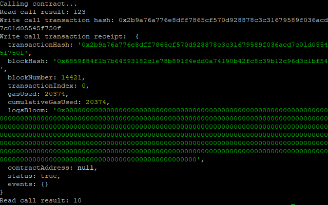

1. A screenshot of the console output immediately after you have successfully issued a smart contract call.
   
2. 0x2b9a76a776e8dff7865cf570d928878c3c31679589f036acd7c01d05545f750f
3. 0xB5b2cC0A271A589d2dda64f19143453CA7E0F2AD
4. ```
   [
    {
      "inputs": [],
      "stateMutability": "payable",
      "type": "constructor"
    },
    {
      "inputs": [
        {
          "internalType": "uint256",
          "name": "x",
          "type": "uint256"
        }
      ],
      "name": "set",
      "outputs": [],
      "stateMutability": "payable",
      "type": "function"
    },
    {
      "inputs": [],
      "name": "get",
      "outputs": [
        {
          "internalType": "uint256",
          "name": "",
          "type": "uint256"
        }
      ],
      "stateMutability": "view",
      "type": "function"
    }
   ]
   ```
