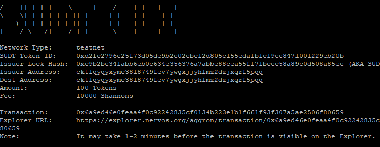
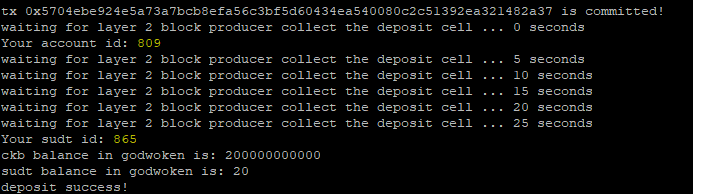

1. A link to the Layer 1 address you funded on the Testnet Explorer.
   https://explorer.nervos.org/aggron/address/ckt1qyqyxymc38l8749fev7ywgxjjyhlmz2dzjxqrf5pqq
2. A screenshot of the console output immediately after using sudt-cli to create your SUDT tokens on Layer 1.
   
3. A link to the transaction ID created by sudt-cli on the Testnet Explorer.
   https://explorer.nervos.org/aggron/transaction/0x6a9ed46e0feaa4f0c92242835cf0134b223e1b1f661f93f307a5ae2506f80659
4. A screenshot of the console output immediately after you have successfully submitted a deposit to Layer 2 using the account-cli tool.
   
5. The SUDT ID from the console output after executing the deposit script (in text format). 
865
