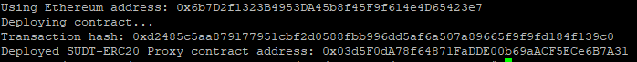
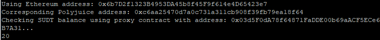

1. A screenshot of the console output immediately after deploying smart contract.
   
2. The address of the ERC20 Proxy Contract you deployed (in text format).  
   0x03d5F0dA78f64871FaDDE00b69aACF5ECe6B7A31
3. A screenshot of the console output immediately after checking your SUDT balance.
   
4. The Ethereum address that was checked (in text format).    
0x6b7D2f1323B4953DA45b8f45F9f614e4D65423e7
