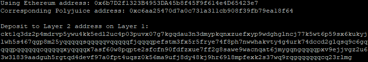

1. A screenshot of the console output immediately after you have successfully generated your Deposit Receiver Address.
   
2. Your Deposit Receiver Address (in text format).  
ckt1q3dz2p4mdrvp5ywu4kk5edl2uc4p03puvx07g7kgqdau3n3dmypkqnxzuefxyp9wdghglncj77k5wt6p59sx6kukyjlwh5s467qgp8m25yqqqqqsqqqqqvqqqqqfjqqqqpefstm3fx5r5frye74f8ph7nwwhakvty4g4urk74dccd2glqsq9c6gqqqqpqqqqqqcqqqqqxyqqqqx7asf60w8pqpte2sfcfn90fdfzxue7ff2g8sawe9wacnqat6jmygqngqqqqpxv9ejjvgz2u63w3l839aadguh5rgtqd4devf97a0fpt4uqsz0k56ma9ufj8dy48kj9hr69l8mpfexk2s37wq9rqgqqqqqqcq23rlmg
3. The Ethereum address used to generate the Deposit Receiver Address (in text format).  
   0x6b7D2f1323B4953DA45b8f45F9f614e4D65423e7
4. A link to the Etherscan explorer for the successful Force Bridge transaction. This can be found on Force Bridge under History→Succeed.  
   https://rinkeby.etherscan.io/tx/0xa37a76132456ddfbab6c660f7070f805426ca271532d45a27a280c34f58a43ed
5. A link to the Nervos explorer for the successful Force bridge transaction. This can be found on Force Bridge under History→Succeed.  
   https://explorer.nervos.org/aggron/transaction/0x276affe035fabcf8ab248322914cf72216717526bf07dfb7cfae78ca64352556
