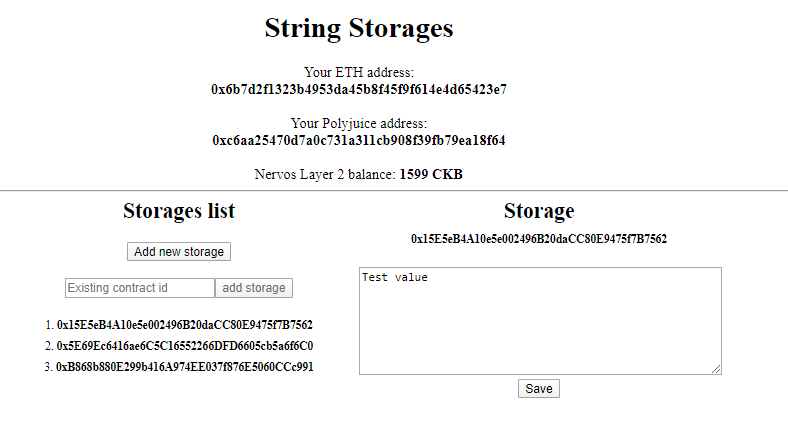

1. Screenshots or video of your application running on Godwoken:
   It's my first application and took many hours.
 
3. Link to the GitHub repository with your application which has been ported to Godwoken. This must be a different application than the one covered in this guide.  
   https://github.com/nervos2021/gitcoin_nervos/tree/main/task7/app


3. If you deployed any smart contracts as part of this tutorial, please provide the transaction hash of the deployment transaction, the deployed contract address, and the ABI of the deployed smart contract. (Provide all in text format.)  
   hash: 0x8a36f7cfcef5bccbcd20964faee17b308edbb863a19da65d3e6a62a814e9beba    
   contract address: 0x15E5eB4A10e5e002496B20daCC80E9475f7B7562  
   ABI:
```
 [
    {
      "inputs": [],
      "stateMutability": "payable",
      "type": "constructor"
    },
    {
      "inputs": [
        {
          "internalType": "string",
          "name": "x",
          "type": "string"
        }
      ],
      "name": "set",
      "outputs": [],
      "stateMutability": "payable",
      "type": "function"
    },
    {
      "inputs": [],
      "name": "get",
      "outputs": [
        {
          "internalType": "string",
          "name": "",
          "type": "string"
        }
      ],
      "stateMutability": "view",
      "type": "function"
    }
  ]
```
