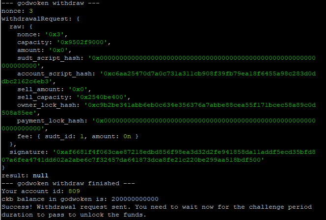

1. A screenshot of the console output immediately after running the withdraw command.
   

2. The Ethereum address that you've used for your Layer 2 account (in text format).  
   0x6b7D2f1323B4953DA45b8f45F9f614e4D65423e7

3. The Nervos Layer 1 address that you passed to withdraw command (in text format).  
   ckt1qyqyxymc38l8749fev7ywgxjjyhlmz2dzjxqrf5pqq
